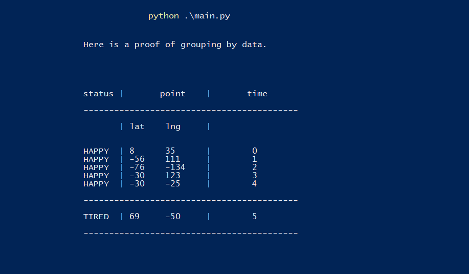
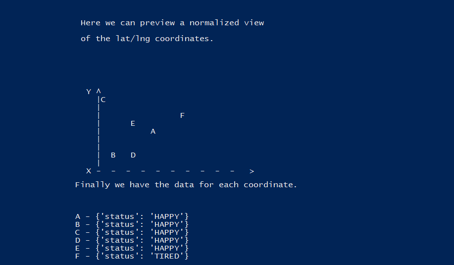
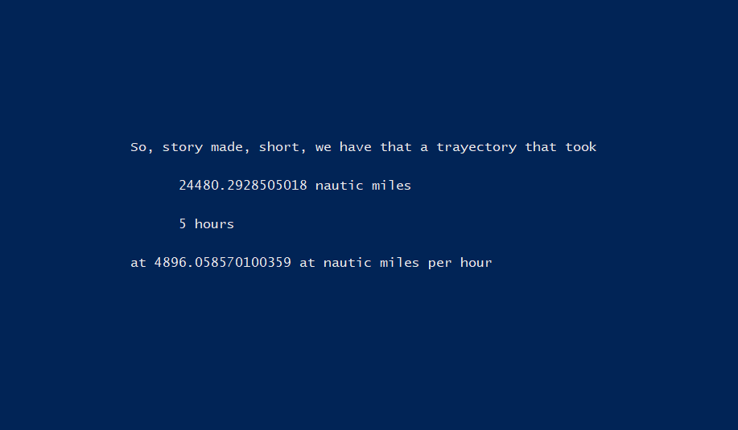
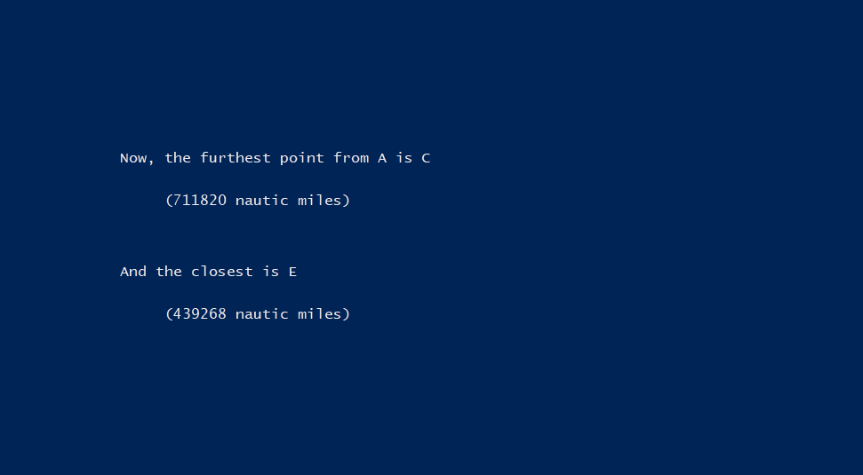
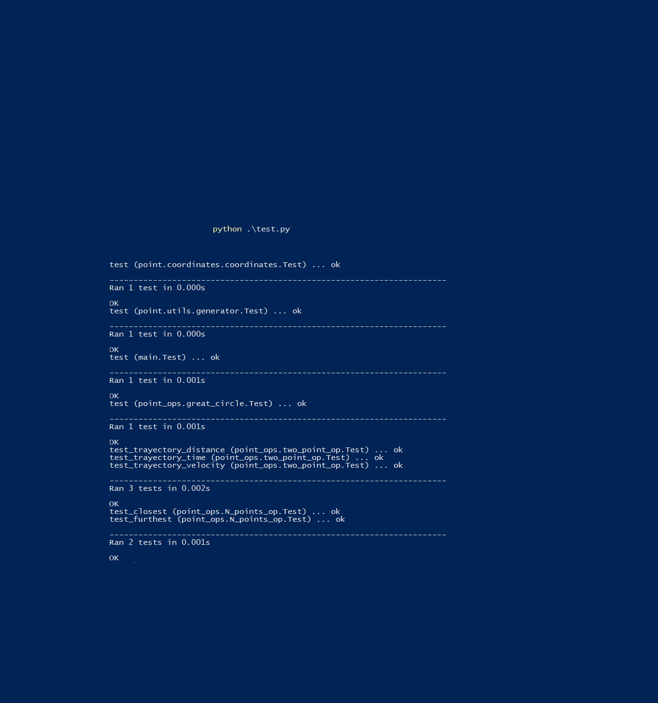

```scala

1) Define "great circle" distance
2) Having a point (2D as in lat,lng) series, a timestamp, and extra data
    .
    .    (1,2 at 2pm)-----(2,2 at 3pm)-----(3,2 at 4pm )
    .   {status:HAPPY}   {status:TIRED}   {status:TIRED}
    .
 Y  .
    .  .  .  .  .  .  .  .  .  .  .  .  .  .
       X

      - Calculate the final distance in meters of the total trayectory
      - Calculate the total trayectory time
      - Calculate the velocity between points
      - Calculate average velocity
      - Group common data

      status |    point     |  time
      -----------------------------
       HAPPY | [(1,2)]      | [(2pm, 3pm)]
       TIRED | [(2,2, 3,2)] | [(3pm, 4pm)]

3) Having a point, and an array of points:
    define closest, furthest,
    radious of circle that starts at central point and ends at furthest point


```
 
 
 
 
 
